# TD Conception de PCB

2 séances de 2

Objectifs pédagogiques :
* Lecture d'une datasheet
* Réalisation d'un schéma à partir de datasheets
* Ajouter les composants essentiels au bon fonctionnement des différents composants
* Associer chaque composant à la bonne empreinte
* Acquérir une technique de placement des composants sur le board
* Réaliser le routage de la carte en respectant des règles élémentaires (largeurs de pistes en fonction du courant, isolation des pistes, etc...)
* Export des gerbers

## Introduction 
* Microcontrôleur STM32L021K4T6,
* DAC MCP4801-E/SN,
* Régulateur linéaire BU33SD5WG-TR,
* 2 LED au format 0603,
* Connecteur de programmation FTSH-107-01-F-DV,
* Plusieurs composants passifs (résistances, condensateurs...) en 0603.

## Schematic

### Components

#### Microcontroleur sous KiCAD

##### Configuration du microcontroleur sous STM32CubeIDE
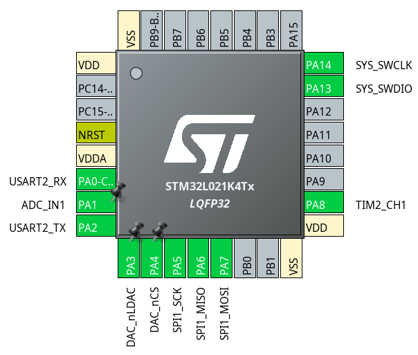

##### Microcontroleur avec composants essentiels

Add a symbol

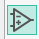

Add a power port

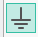

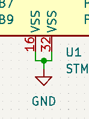

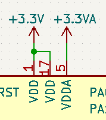

Add a global label

Reset signal

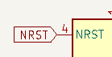

Power filter

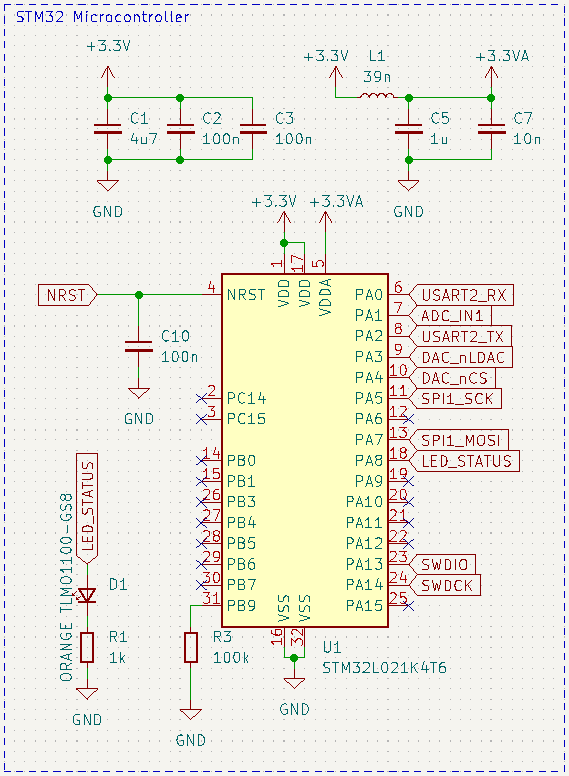

#### Power

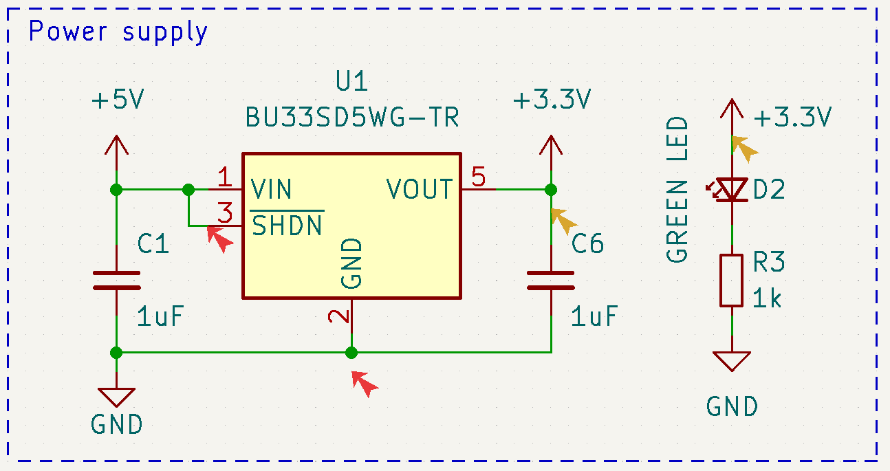

#### DAC

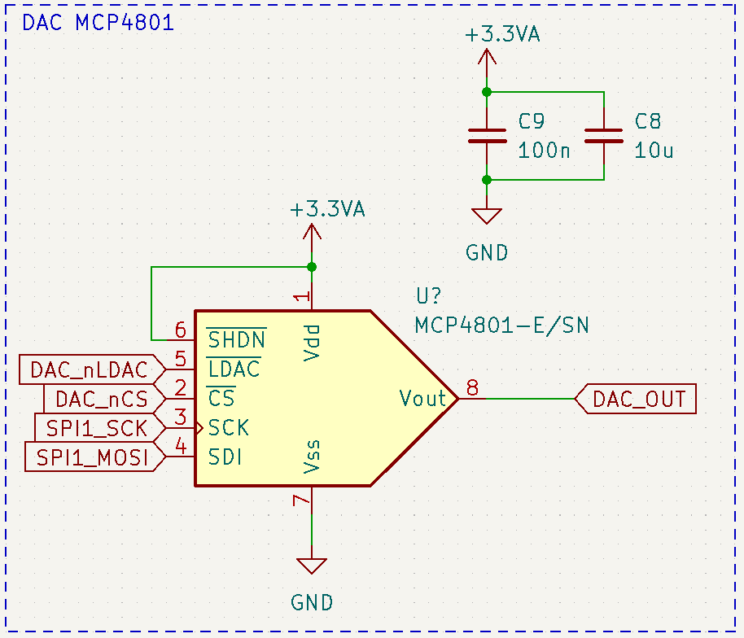

#### Connecteurs

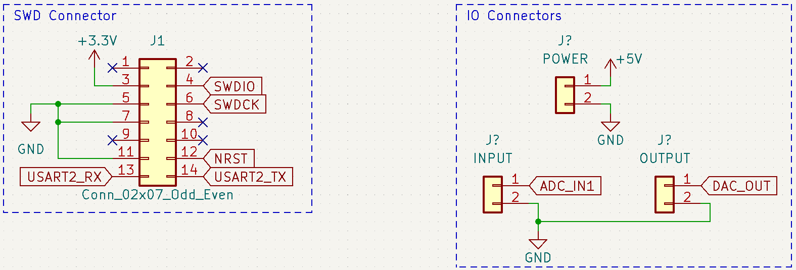

#### Fixation

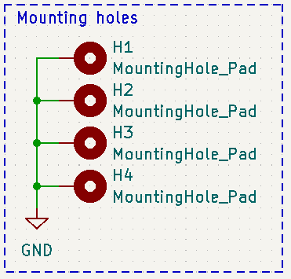

### Numerotation

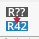

### Electronic Rule Check

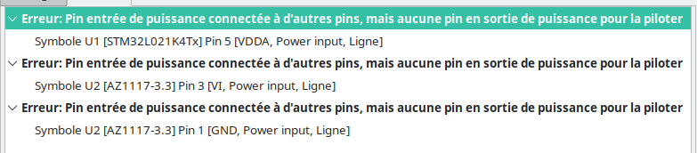

### Footprint assigment

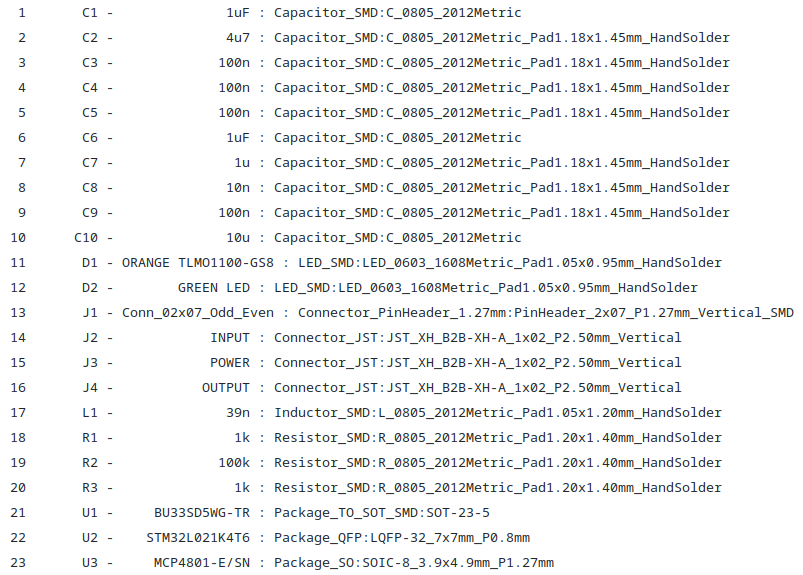

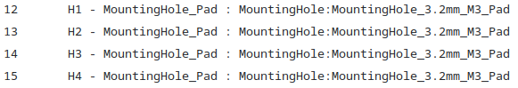

## Board

Rajout choix taille PCB

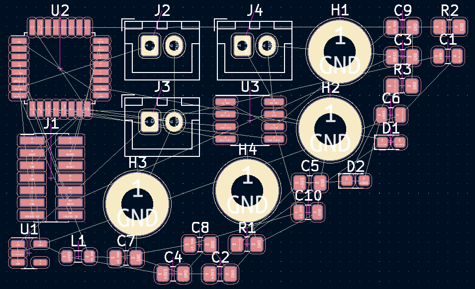

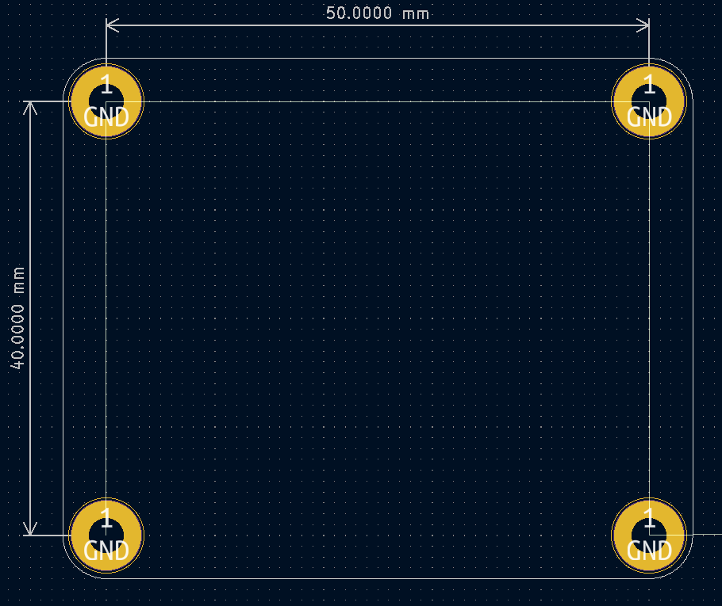

Dans quel ordre placer ses composants

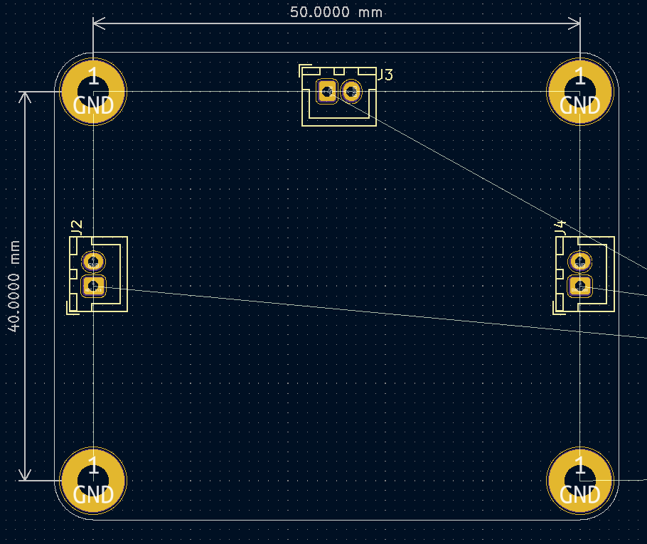

### 

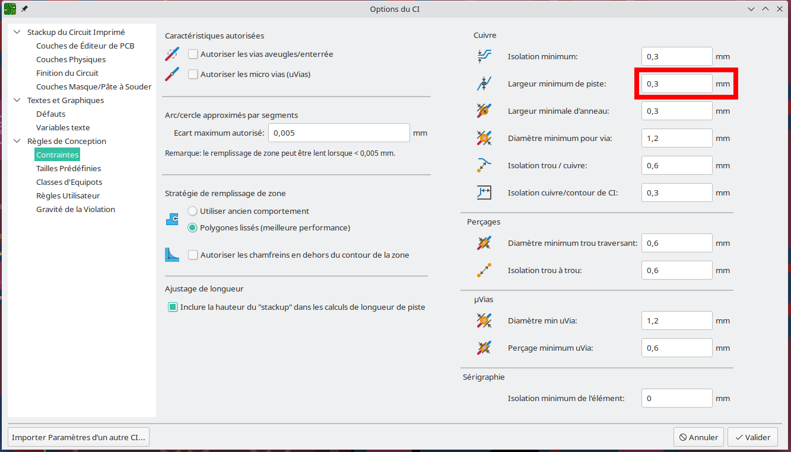

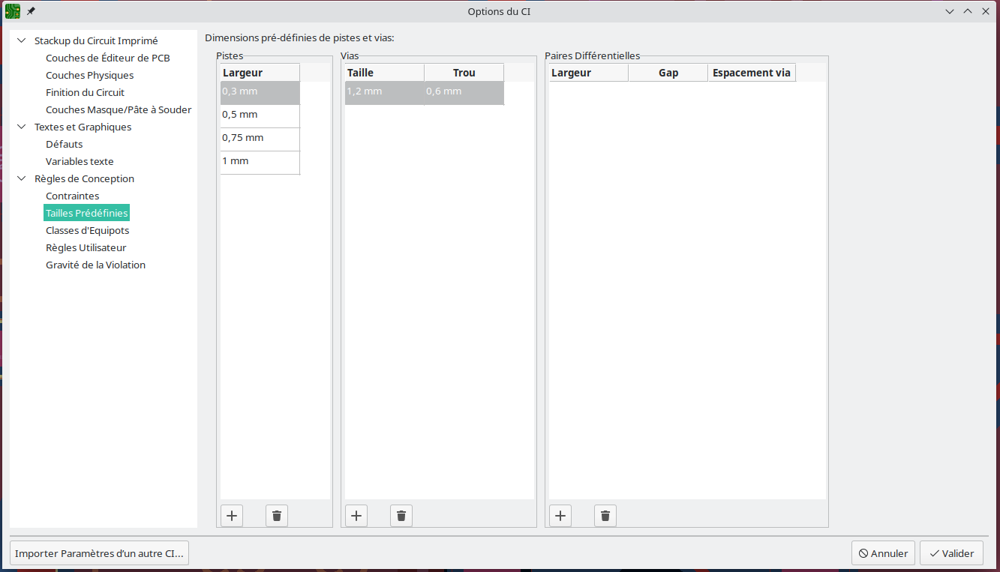

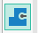

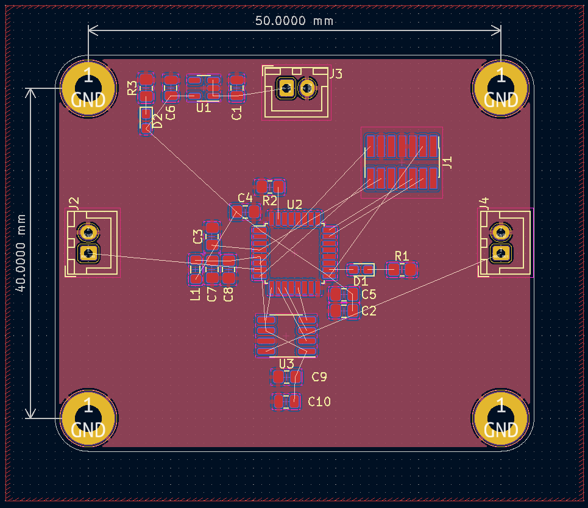

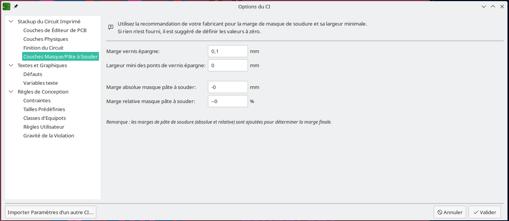

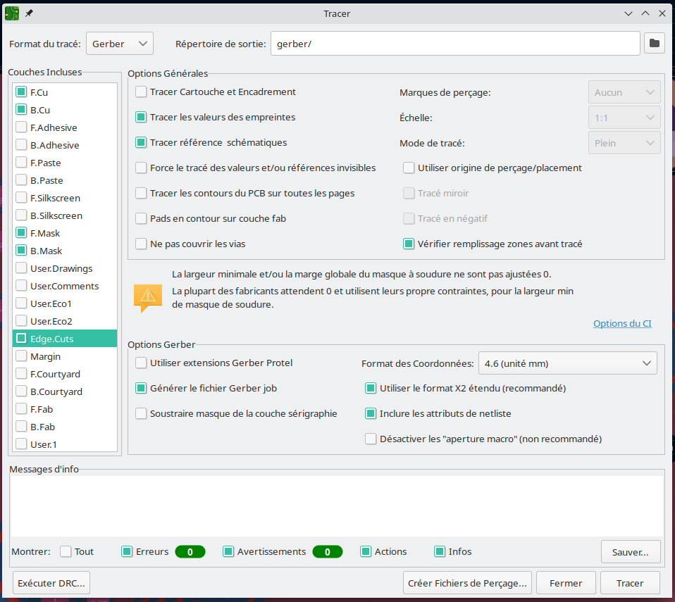

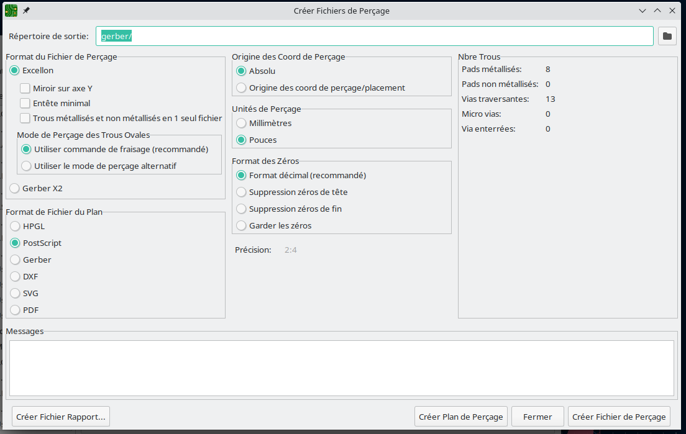

## Autres
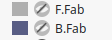

          
